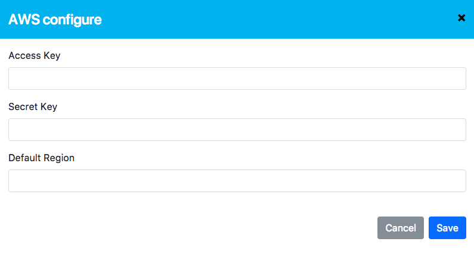

# An automatic training system for deep learning

This is a three weeks project demostrate the idea of automated training. 

### Features:

    * Use predefined file(JSON) to define Deep Learning network architeture
    * Support modular model to reduce the complicity of JSON of similar models
    * Pretrained model can be loaded into different architecture
    * Training instances(dockerized) can deploy to anywhere

## Structure of package

    Dockerfile.service      Docker file for Restful service
    Dockerfile.worker       Docker file for Training instance
    cli.sh                  bash script redirect to cli.py
    - package               Python package main folder
        - insight
            - __init__.py
            - agent.py
            - applications
                - AgentService.py       Agent service entrance
                - RESTservice.py        Restfull service entrace
                - cli.py                A command-line based client
                - settings.py           general settings
                - worker.py             Worker entity run inside docker
            - builder.py                Model builder
            - optimizer.py              NULL
            - storage.py                Manipulate AWS DynamoDB and S3
            - web                       All Web related code
                REST_server.py          Back-end, Restful service
                - static                Front-end
                    css
                    fonts
                    images
                    index.html          Main html
                    js
        setup.py
        - test
            service_test.py
            unit_test.py
    run_agentservice.sh               Shortcut to start agent service
    run_restservice.sh                Shortcut to start restful service
    run_worker.sh                     Docker.worker entry point
    settings.py                       Setting file refer by docker container
    start_restful_docker_service.sh   bash script of starting docker container to run restful service

## How to deploy
Two kinds of services:

    A. Restful servie (ONLY need one)
    B. Training instance (Not limited, the more the better)

### A. Restful service
1). Change the `Moniter Service` and `Worker Image` in settings.py
```Python
DOCKER = {
    'IMAGE': 'jmhoo/insight-worker',
    'VERSION': 'latest'
}

MONITOR = {
    'HOST': 'http://insight.umx.io',
    'PATH': '/monitor'
}
```

2). Build the `service` docker image
``` docker
    docker build -t insight/kservice -f Dockerfile.service .
``` 

3). Start the service
```bash
    ./start_restful_docker_service.sh
```

### B. Training instance

1). Install Nvidia driver, docker and nvidia-docker
``` bash
# install docker
curl -fsSL https://download.docker.com/linux/ubuntu/gpg | sudo apt-key add -

sudo add-apt-repository \
       "deb [arch=amd64] https://download.docker.com/linux/ubuntu \
       $(lsb_release -cs) \
       stable" && sudo apt-get update

sudo apt install -y docker-ce

# install nvidia driver and cuda
sudo add-apt-repository ppa:graphics-drivers/ppa -y
sudo apt update
sudo apt install nvidia-375 -y
wget https://developer.nvidia.com/compute/cuda/8.0/Prod2/local_installers/cuda-repo-ubuntu1604-8-0-local-ga2_8.0.61-1_amd64-deb
sudo dpkg -i cuda-repo-ubuntu1604-8-0-local-ga2_8.0.61-1_amd64-deb
sudo apt-get update
sudo apt-get install cuda -y

# Install nvidia-docker
wget -P /tmp https://github.com/NVIDIA/nvidia-docker/releases/download/v1.0.1/nvidia-docker_1.0.1-1_amd64.deb
sudo dpkg -i /tmp/nvidia-docker*.deb && rm /tmp/nvidia-docker*.deb
```

2). Build the `worker` docker image
``` docker
    docker build -t insight/tworker -f Dockerfile.worker .
```

3). Export Environment variable for Training instance(temporary)
``` bash
export AWS_ACCESS_KEY_ID={ACCESS_KEY}
export AWS_SECRET_ACCESS_KEY={SECRET_KEY}
export AWS_DEFAULT_REGION={REGION}
```

4). Start `Agent` service on training instance
``` bash
nvidia-docker run --rm -it --name insight --hostname {YOUR INSTANCE NAME} -v /var/run/docker.sock:/var/run/docker.sock -e AWS_ACCESS_KEY_ID=${AWS_ACCESS_KEY_ID} -e AWS_SECRET_ACCESS_KEY=${AWS_SECRET_ACCESS_KEY} -e AWS_DEFAULT_REGION=${AWS_DEFAULT_REGION} insight/tworker
```

### Final step
Access the system through:

    http://[YOUR IP or DOMAIN where running restful service]

Set AWS credentials by clicking the `setting` on the left:



## Screenshot
